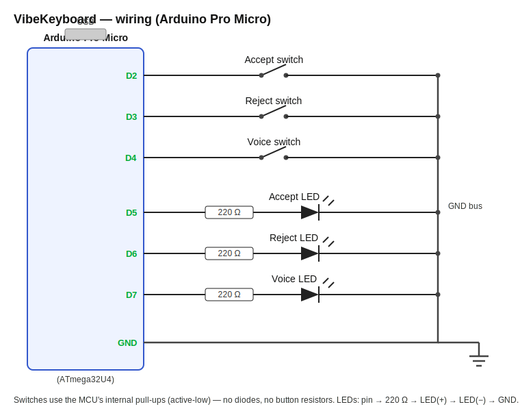

# VibeKeyboard

A tiny **3-button USB macro pad for vibe coding** — built on an Arduino Pro Micro with
standard Cherry MX switches. It plugs in as a normal USB keyboard (no drivers, any OS) and
gives you one physical button each for the three things you do constantly when coding with
an AI assistant:

| Button | What it does | Default keystroke |
|--------|--------------|-------------------|
| 🎙️ **Voice** | Push-to-talk dictation (hold to talk, release to stop) | holds `Space` |
| ✅ **Accept** | Confirm the AI's proposed action | taps `Enter` |
| ❌ **Reject** | Cancel / decline the AI's proposed action | taps `Esc` |

Each button has its own **status LED**. A customizable light pattern plays on power-up;
afterwards each LED lights only while its button is pressed (so the Voice LED stays on the
whole time you're holding to talk).

The defaults target **Claude Code in a terminal**, but every key is a one-line edit away
from working with Cursor, Copilot, or anything else — see [Configuration](docs/CONFIGURATION.md).

---

## Features

- **Plug-and-play USB-HID** — the Pro Micro's ATmega32U4 emulates a real keyboard; no host software.
- **Dead-simple electronics** — 3 switches read with internal pull-ups: **no diodes, no key matrix, no button resistors**. Only 3 resistors total (one per LED).
- **One dimmable LED per button** (PWM) running a continuous **wave** animation that flows across the backlit logo; a button press lights its LED full, then the wave resumes.
- **Fully configurable firmware** — keys, pins, push-to-talk vs. toggle, debounce, and the LED pattern are all constants at the top of a single, heavily-commented `.ino`.
- **No third-party libraries** — just the built-in Arduino `Keyboard` library.

## Bill of materials

| Qty | Item |
|-----|------|
| 1 | Arduino Pro Micro (ATmega32U4, 5 V / 16 MHz) |
| 3 | Cherry MX switches (any variant) + keycaps |
| 3 | LEDs (3 mm or 5 mm) |
| 3 | 220 Ω resistors |
| — | Hookup wire, solder, a USB cable for the Pro Micro |

Full list with tools: [`hardware/BOM.md`](hardware/BOM.md).

## Wiring at a glance

| Function | Pro Micro pin |
|----------|---------------|
| Accept switch | `A0` → GND |
| Reject switch | `A1` → GND |
| Voice switch | `A2` → GND |
| Voice LED *(left)* | `D5` (PWM) → 220 Ω → LED → GND |
| Accept LED *(mid)* | `D6` (PWM) → 220 Ω → LED → GND |
| Reject LED *(right)* | `D9` (PWM) → 220 Ω → LED → GND |

Pins are chosen to keep I²C, SPI, UART and a spare PWM free for future add-ons — see [`docs/WIRING.md`](docs/WIRING.md).

Details and the reasoning behind it: [`docs/WIRING.md`](docs/WIRING.md).

## Quick start

1. **Build it** — solder the three switches and LEDs to the Pro Micro following [`docs/ASSEMBLY.md`](docs/ASSEMBLY.md).
2. **Flash it** — open [`firmware/vibe_keyboard/vibe_keyboard.ino`](firmware/vibe_keyboard/vibe_keyboard.ino) in the Arduino IDE and upload. Step-by-step: [`docs/FLASHING.md`](docs/FLASHING.md).
3. **Set up voice** — Voice holds **Space**, Claude Code's built-in push-to-talk key. Tap **Voice+Accept** to run `/voice`, then hold Voice to dictate. (Prefer a global dictation app? Switch `VOICE_KEY` to `KEY_F13` — see [`docs/CONFIGURATION.md`](docs/CONFIGURATION.md).)
4. **Use it** — the LEDs fade up on boot, then the wave flows. Tap **Accept**/**Reject** in your editor; hold **Voice** to dictate.

## Documentation

- [Assembly / soldering guide](docs/ASSEMBLY.md)
- [Wiring reference](docs/WIRING.md)
- [Flashing the firmware](docs/FLASHING.md)
- [Configuration & remapping](docs/CONFIGURATION.md)
- [Bill of materials](hardware/BOM.md)
- [Design spec](docs/superpowers/specs/2026-06-05-vibekeyboard-design.md)

## Build your own / contributing

This is open hardware — fork it, rebuild it, remix the layout. Issues and pull requests
welcome (extra layouts, alternate keymaps, case designs). If you design an enclosure, drop
your STL + logo into the local [`case/`](case/) folder (it's git-ignored by default).

## License

[MIT](LICENSE) © Dominik Hartl
